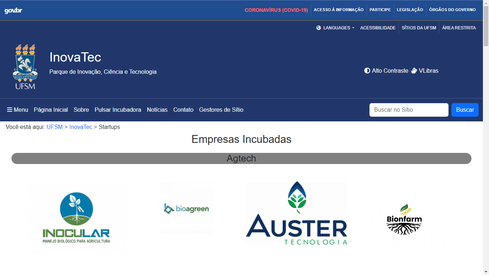

# Projeto: Remake de site/app web

Acesso: Substitua este texto pela URL para acesso ao site publicado

#### Desenvolvedor(a)
Nome: Matheus de Almeida
Curso: Ciência da Computação

#### Site/app escolhido

##### Link
https://www.ufsm.br/orgaos-suplementares/inovatec/startups

##### Descrição
O site escolhido foi a página de startups da InovaTec, a qual apresenta as empresas que são incubadas pela InovaTec. As empresas são apresentadas em 4 colunas separadas por tipo de empreendimento como empresas de Agtech, FoodTech, EduTech, entre outros tipos. A forma de apresentação é a logomarca da empresa a qual quando clicada leva até o site da empresa.

Além disso, a página possui elementos interessantes a serem explorados, tais como menus colapsáveis (ao clicar em menu, ou órgãos do governo), menus dropdown (ao clicar em languages), uma barra de busca e o uso de ícones.

#### Desenvolvimento

O conteúdo foi coletado à mão, copiando os endereços de cada link e os endereços das imagens, explorando o código fonte da página e encontrando informações úteis em relação às cores e à disposição de elementos. Para esse trabalho em específico, o projeto foi realizado conforme eu ia adquirindo mais conhecimento com as ferramentas.

O foco utilizado durante o remake foi alcançar uma página visualmente próxima da original, mantendo as funcionalidades mais específicas dos menus colapsáveis e dropdown, ao mesmo tempo em que adquiria o conhecimento de como alcançar essas funcionalidades utilizando as ferramentas disponíveis.

#### Tecnologias

- HTML
- CSS
- Bootstrap 5(https://www.w3schools.com/bootstrap5/)

#### Ambiente de desenvolvimento

- VS Code
- Google Chrome

#### Referências e créditos

- [Bootstrap 5 Tutorial](https://www.w3schools.com/bootstrap5/)
- [Font Awesome 5 Icons](https://www.w3schools.com/icons/fontawesome5_intro.asp)

---
Projeto entregue para a disciplina de [Desenvolvimento de Software para a Web](http://github.com/andreainfufsm/elc1090-2024a) em 2024a